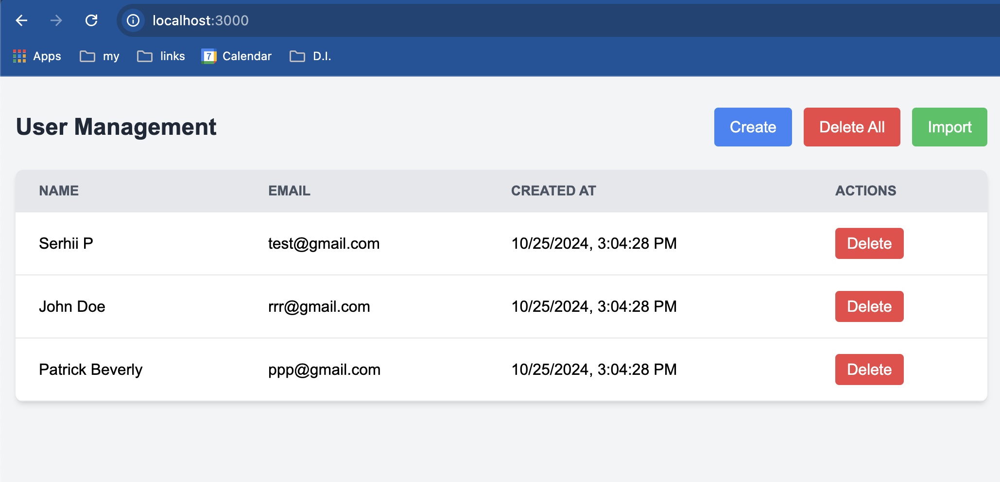
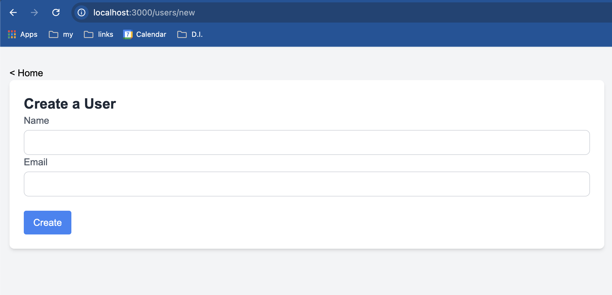

## Завдання "веб-додаток для управління користувачами"

Проект викорисовує Next.js v15 та React v19.

### Використані бібліотеки

- prisma (для роботи з базою)
- exceljs (парсінг xlsx файлів)

База даних - MySQL. Для запуску треба мати встановлений Docker і виконати команду "docker-compose up -d".

Для локального запуску застосунку (npm run dev) треба перейти: [http://localhost:3000](http://localhost:3000).

Для тестування імпорту можна використовувати файл test-upload.xlsx в руті проекту.

## Нюанси

- тестів поки не додавав

## Скріншоти
### Головна сторінка

### Створення юзера

